# Project Title: Xây dựng website tổng hợp, quản lý khách sạn

### Purpose of the project
This project involves developing a comprehensive website for hotel management, providing a platform for customers to easily access and book rooms while optimizing the hotel's management processes. The website aims to enhance customer experience, streamline hotel operations, and improve competitive capabilities.

## What to prepare
Install mySQL, python, nodejs, reactjs,...
### Technology used
- Programming software: Visual Code Studio

- Web server: XAMPP

- Source code management: Github

- Tool for designing object-oriented design and analysis diagrams: https://app.diagrams.net/
- Front-end construction:

- + Language: HTML, CSS, Javascript

- + Framework: Reactjs, SCSS

- Back-end construction:

- + Language: Javascript

- + Framework: Nodejs

- Database design software: MySQL

- Authentication and authorization: JWT
## How to run
After cloning the project and opening the solution file, you will see the project folder structure like this:
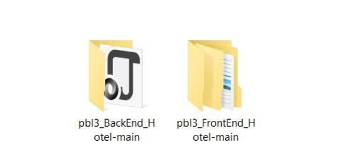
model-controller
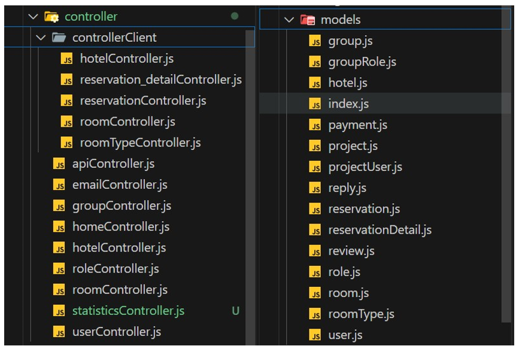
View
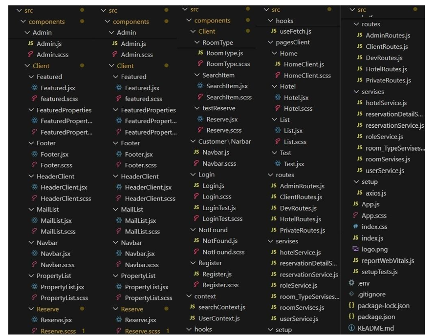
## Databases
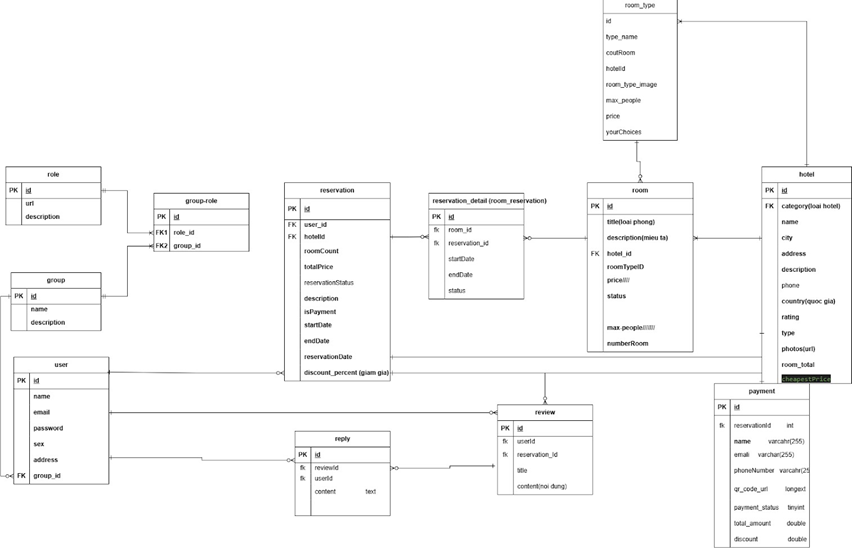
## Usecase diagram
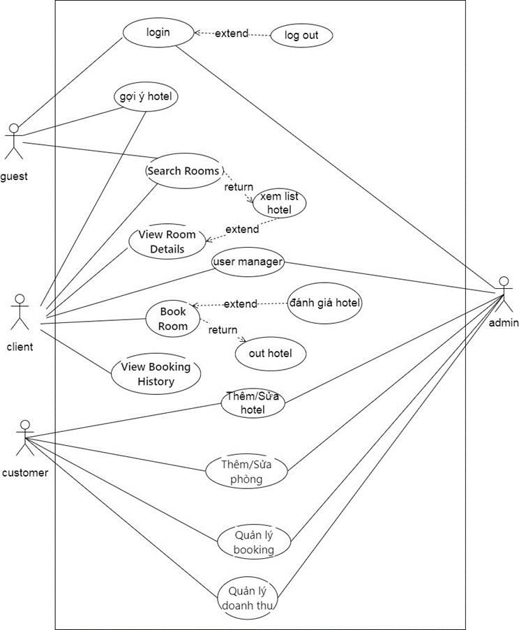

## ALGORITHM ANALYSIS
- Search and filtering algorithm
- Proposed algorithm
- Crawler algorithm
## Features
### Login function
- Admin/User enters login name and password, the system will check the database and then respond to admin/user.
- If there is no account with the corresponding login name and password, the system will report an error of incorrect login name or password.
### Search - booking function
- For clients:
   + Enter personal information, then the system will retrieve the data and display appropriate search results
   + Client can click on the desired result to see detailed information
   + Fill in personal information and press the "Book" button to reserve a room
### Management function
- For admins:
   + Add, delete, edit client/customer
- For clients:
   + Add, delete, edit personal information
   + Add, delete, edit accounts
   + Add, delete, edit booking orders
- For customers:
   + Add, delete, edit businesses
   + Add, delete, edit customers
   + Add, delete, edit booking orders
## Program interface
- Testing various scenarios such as system login, data entry/view, search and statistics functions, and query/report functions.
- Evaluation of the system's performance and user feedback.

### Scenario 1 – Login system
*Figure 1: Login Interface*
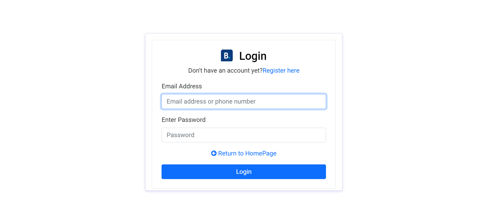

### Scenario 2 – Main interface for users

1. Interface for Client
*Figure 2: Main Interface for Client*
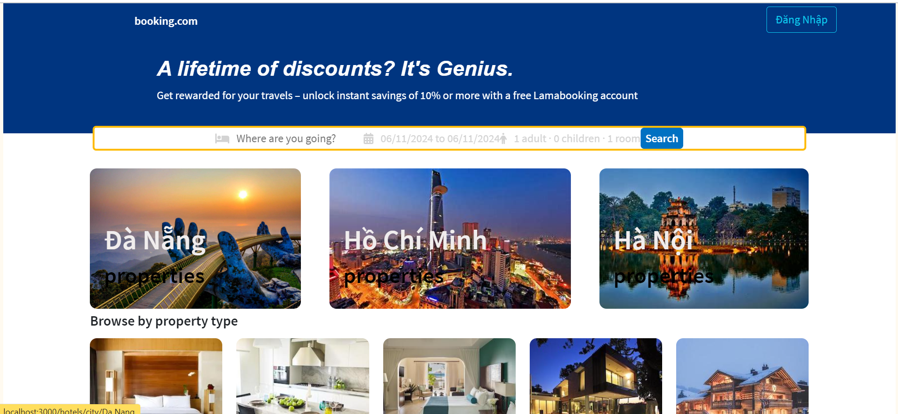

2. Interface for Admin
*Figure 3: Main Interface for Admin*
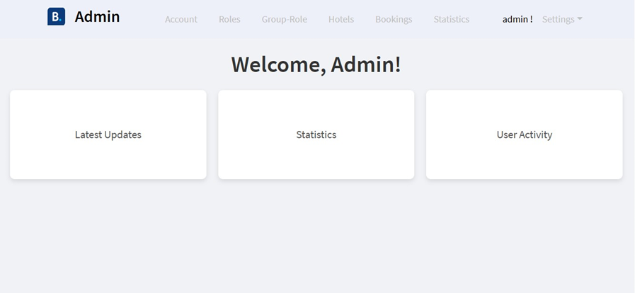

3. Interface for Customer
*Figure 4: Main Interface for Customer*
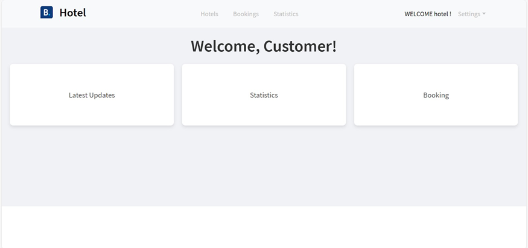

### Scenario 3 – Search and statistics functions

#### Interface for Client
*Figure 5: Search interface*
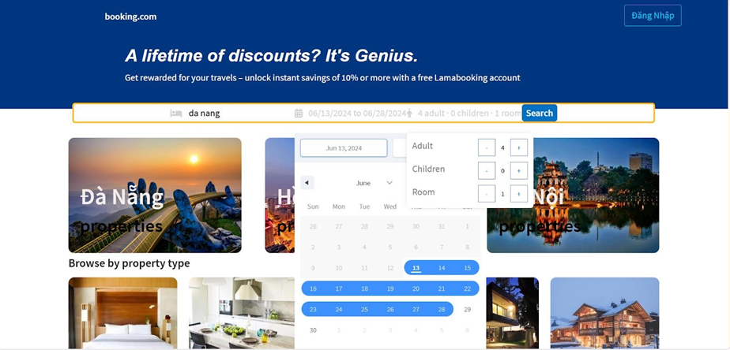

*Figure 6: Export search results*
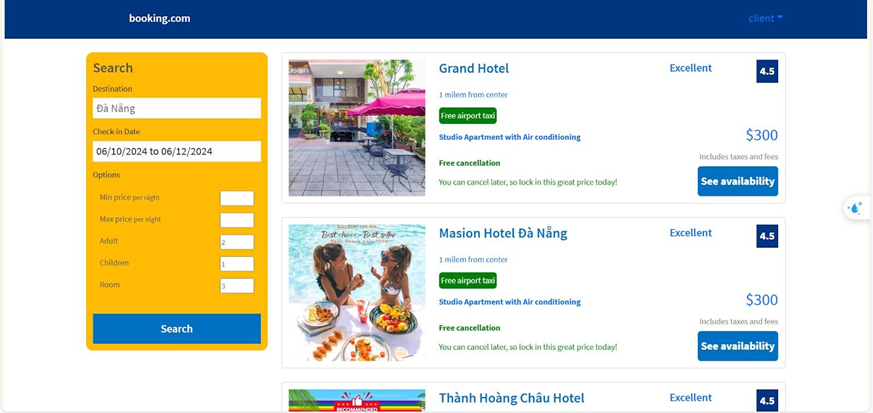

*Figure 7: View hotel booking information*
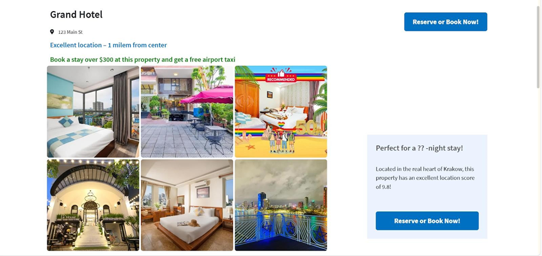
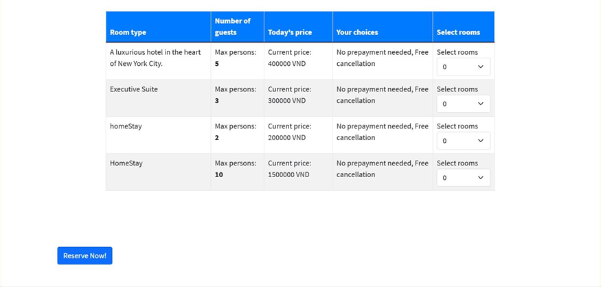

*Figure 8: Fill in basic information to book a room*
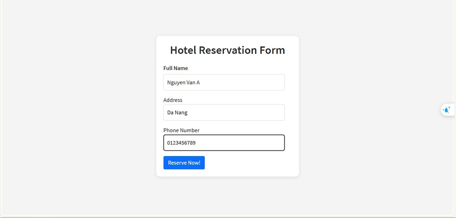

*Figure 9: Pay with momo*
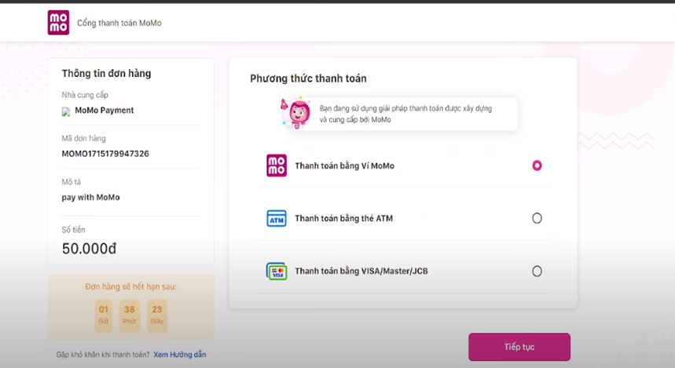

*Figure 10: Send booking results to email*
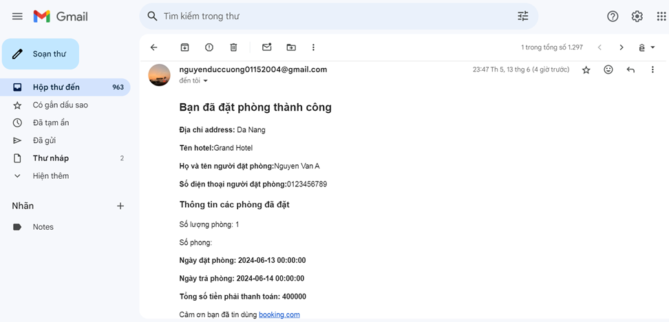

#### Interface for Admin
*Figure 11:User managementn*
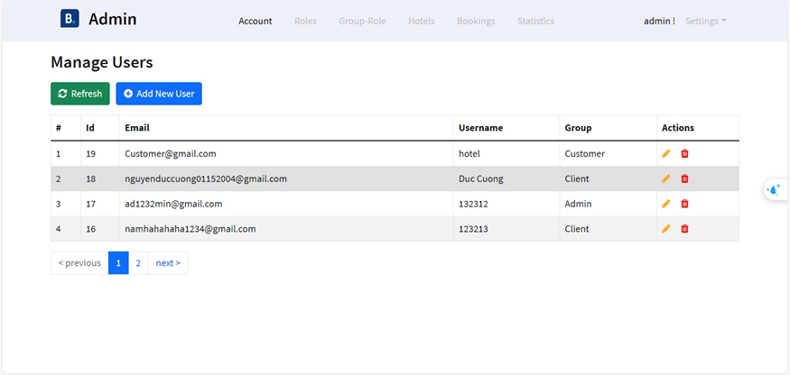

*Figure 12:add users*
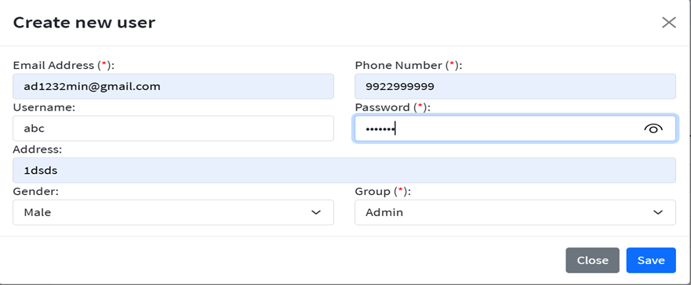

*Figure 13:Manage roles*
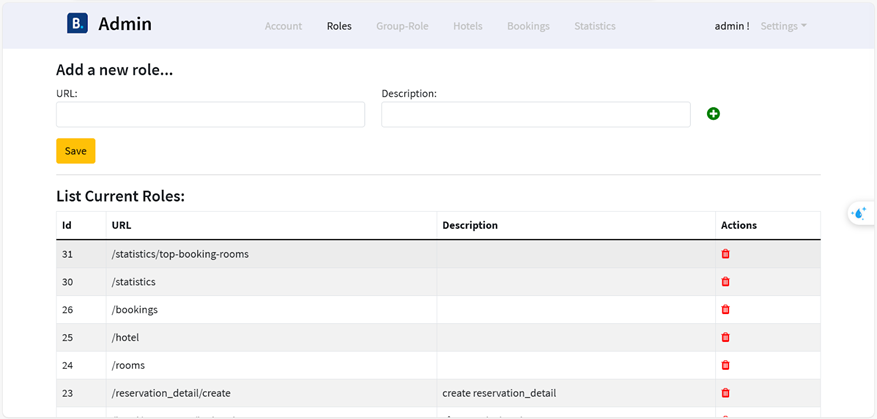

*Figure 14:Manage group*
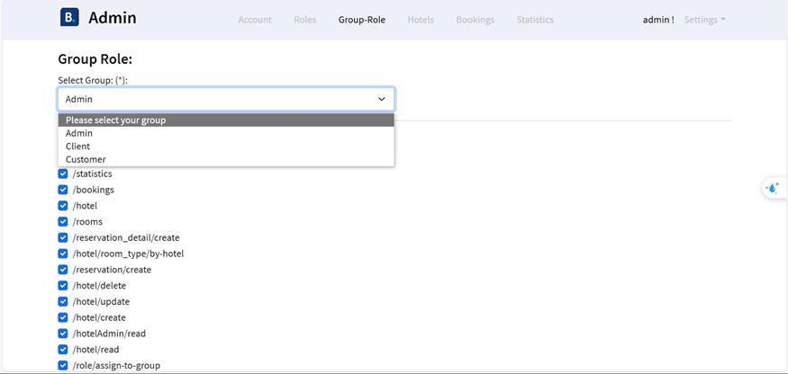

*Figure 15: Hotel and room management*
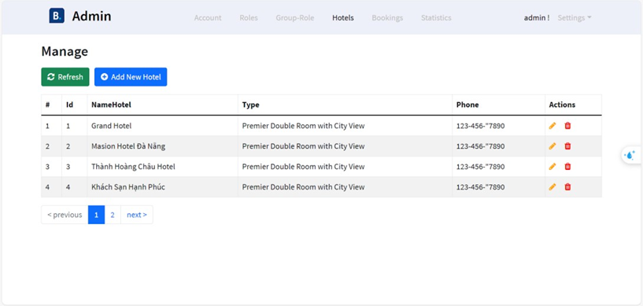
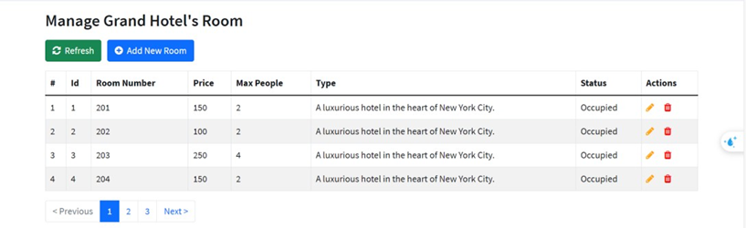
create room
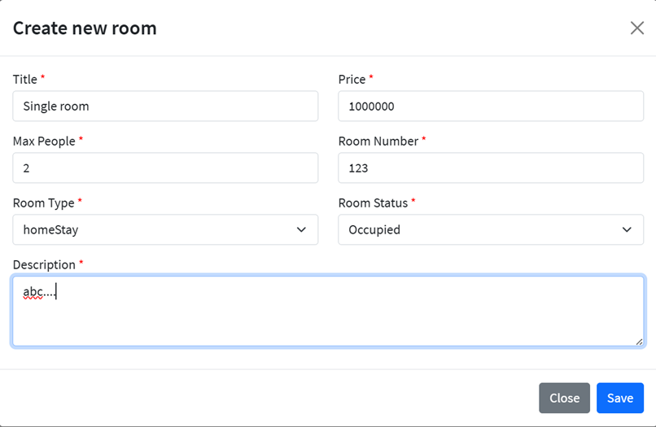
*Figure 16:Manage bookings*
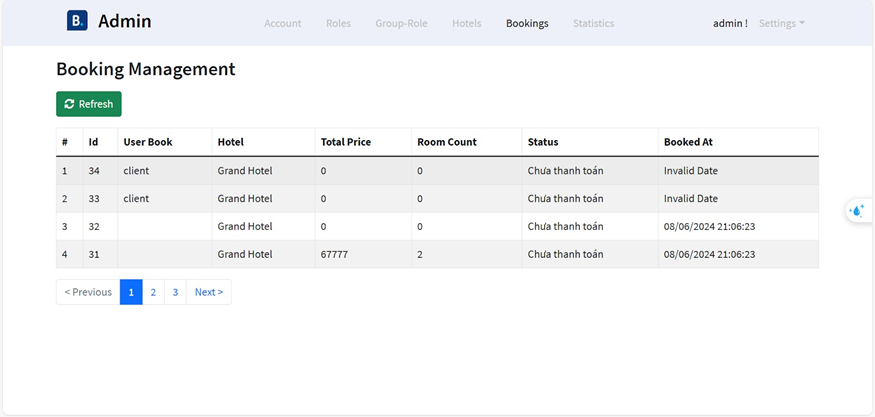

*Figure 17:Revenue statistics*
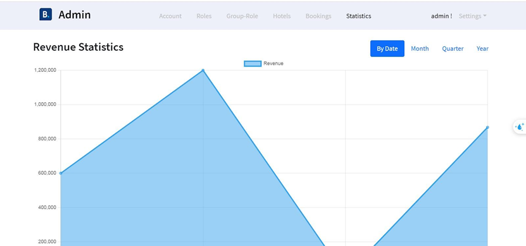

### Interface for Customer
*Figure 18: Hotel and room management*

create room

*Figure 19:Manage bookings*

*Figure 20:Revenue statistics*

